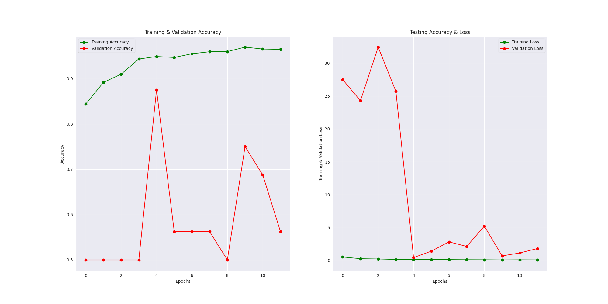

# Chest X-Ray Images (Pneumonia) - Machine Learning Project

## Project Overview
This project uses **machine learning** to detect **pneumonia** from **chest X-ray images**. The goal is to build a model that can accurately classify chest X-ray images as either **Normal** or **Pneumonia** using image processing and deep learning techniques.

The project is implemented in **Python** using **Jupyter Notebook (Colab)** and popular libraries like TensorFlow, Keras, OpenCV, and Matplotlib.

---

## Sample Images

**Example X-ray Image:**


**Countplot of Dataset:**


**Confusion Matrix:**


**Training History:**


**Additional Image:**


---

## Repository Structure

- `Chest_X_Ray_Images_(Pneumonia).ipynb` - Main Jupyter notebook containing the full code and model training pipeline.  
- `IM-0001-0001.jpeg` - Sample X-ray image used for testing.  
- `confusion_matrix.png` - Confusion matrix of the model.  
- `countplot.png` - Countplot showing the distribution of Normal vs Pneumonia images.  
- `gr1.jpeg` - Additional analysis image.  
- `training_history.png` - Graph showing training/validation accuracy and loss.

---

## Key Features

- **Data Preprocessing:** Resize, normalize, and augment images.  
- **Model Training:** CNN-based deep learning model.  
- **Evaluation Metrics:** Confusion matrix, accuracy, precision, recall, and loss curves.  
- **Visualization:** Countplots and training history graphs.

---

## Installation

1. Clone this repository:

```bash
git clone https://github.com/mahfuz640/Chest_X_Ray_Images_(Pneumonia).git
cd Chest_X_Ray_Images_(Pneumonia)
